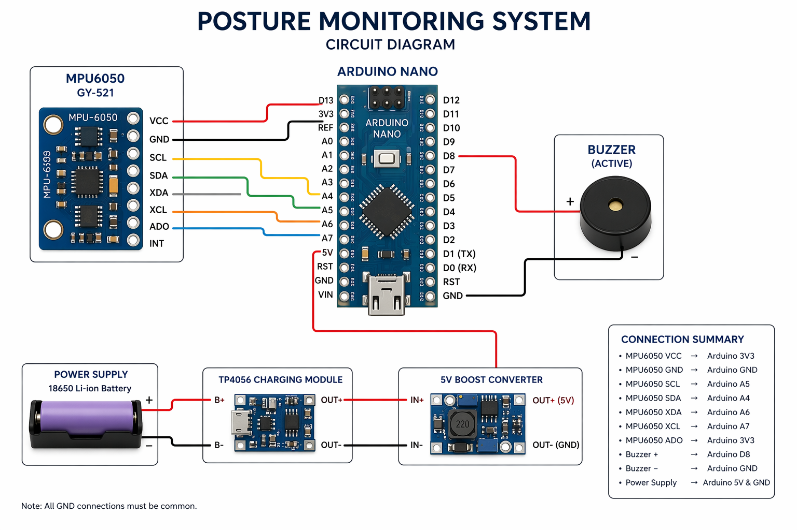
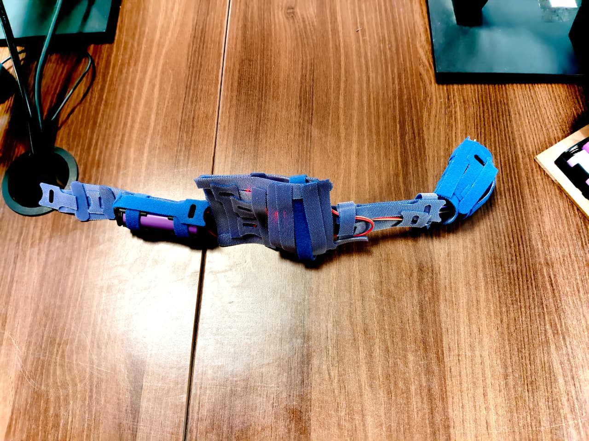

# Wearable Wireless Posture Monitor

A wearable posture monitoring device that detects poor sitting posture using an MPU6050 accelerometer and gyroscope. The system continuously monitors the user's upper body orientation and activates a buzzer if poor posture is maintained beyond a predefined duration.

---

## Project Overview

Poor sitting posture is one of the leading causes of neck pain, shoulder strain, and lower back discomfort among students and office workers. This project provides a simple, low-cost solution by continuously monitoring body orientation and providing immediate auditory feedback whenever prolonged slouching is detected.

---

## Features

- Real-time posture monitoring
- Automatic baseline calibration
- Configurable posture threshold
- 5-second posture validation before alert
- Audible buzzer notification
- Battery-powered standalone operation
- Compact and lightweight wearable design

## Hardware Components

Arduino Nano (ATmega328P)
MPU6050 GY-521 Module
TP4056 Charging Module
MT3608 Boost Converter
Piezo Buzzer

---

## Libraries

- Arduino IDE 2.x
- Wire Library (Built-in)
- I2Cdev Library by Jeff Rowberg
- MPU6050 Library by Jeff Rowberg

---

# Working

1. Power on the device.
2. The MPU6050 initializes and records the user's upright posture as the baseline.
3. The sensor continuously measures body orientation and prints the deviation in terminal.
4. The Arduino compares the current posture with the baseline.
5. If posture deviates beyond the threshold for more than five seconds, the buzzer activates.
6. The buzzer stops once the user returns to the correct posture.

---

# Circuit Diagram

---

# Device

---

# Applications

- Students
- Office workers
- Laptop users
- Library study sessions
- Work-from-home employees

---

# Future Improvements

- Bluetooth connectivity
- Mobile application
- Vibration motor alerts
- Machine learning posture classification
- Cloud synchronization

---
